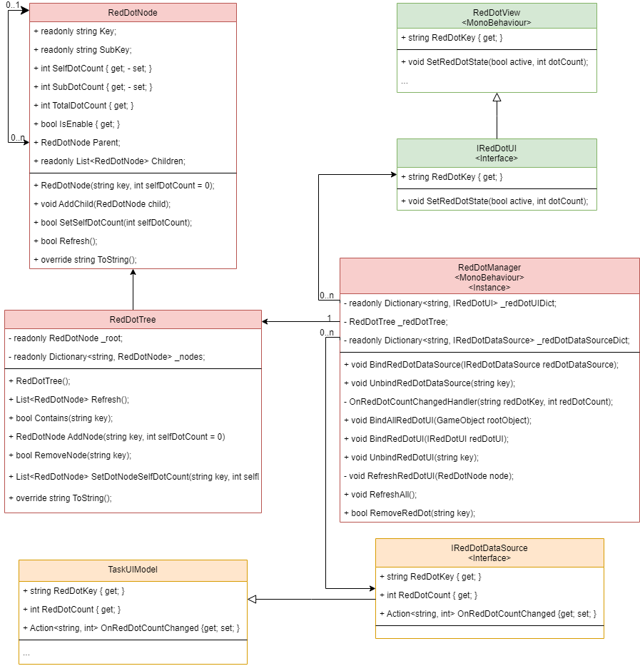

# 红点系统

# 1. 概述

红点系统是一种常用于游戏 UI 中的提示机制，用于向玩家显示未处理状态（如未读消息、任务奖励、好友请求等）。本系统采用层级树的结构来管理各个模块的红点状态，并通过数据源与 UI 组件的绑定，实现数据与界面显示的解耦。系统具备以下特点：

- **层级聚合**：每个红点节点存储自身红点数量（SelfDotCount）以及所有子节点的累计数量（SubDotCount），从而计算出总红点数量（TotalDotCount）和显示状态（IsEnable）。
- **数据驱动**：外部业务数据通过数据源（IRedDotDataSource）驱动红点状态变化，红点树根据数据源更新自身状态。
- **UI 绑定**：每个需要展示红点提示的 UI 组件实现 IRedDotUI 接口，与红点节点一一绑定，确保 UI 显示与数据同步。
- **自动扫描**：提供自动扫描功能，可以传入一个 GameObject 来自动查找并绑定所有实现 IRedDotUI 的组件，简化了手动绑定工作。
- **动态管理**：支持动态添加、更新、刷新以及移除红点节点，适用于模块切换和生命周期管理。

# 2. 框架结构


**RedDotNode**

- 表示红点树中的一个节点。
- 保存自身红点数（SelfDotCount）、子节点累计数（SubDotCount）、总红点数（TotalDotCount）和显示状态（IsEnable）。
- 同时维护指向父节点和子节点的引用。

**RedDotTree**

- 红点节点的管理容器，通过字典保存所有节点，支持按层级添加、更新、刷新、移除等操作。
- 提供按先序或广度优先遍历输出树形结构的方法，方便调试和日志输出。

**RedDotManager**

- 中间层，负责将红点树与外部数据源和 UI 层进行绑定。
- 提供绑定与解绑数据源（IRedDotDataSource）和 UI 组件（IRedDotUI）的接口。
- 提供数据更新响应、全局刷新、节点移除以及自动扫描绑定 UI 的方法。

**IRedDotUI 接口**

- UI 组件实现该接口，需提供 RedDotKey（红点节点的 Key）和 SetRedDotState(bool active, int dotCount) 方法，用于接收红点状态更新。

**IRedDotDataSource 接口**

- 数据源实现该接口，提供 RedDotKey、红点数量（RedDotCount）和一个 OnRedDotCountChanged 事件，数据变化时通知红点系统更新。

**代码类图：**



# 3. 生命周期

1. **初始化阶段**
   - 系统启动时，RedDotManager 的 Awake 方法被调用，初始化单例、创建红点树（调用 Init()），构建基础树结构（创建根节点）。
2. **数据源绑定**
   - 各业务模块在启动或加载时，调用 BindRedDotDataSource 将各自的数据源绑定到对应的红点节点（通过 RedDotKey 关联）。
   - 数据源绑定后，会将初始红点数量写入红点树，并注册 OnRedDotCountChanged 事件。
3. **刷新初始状态**
   - 调用 RefreshAll() 方法，对整个红点树进行全量刷新，确保所有节点（包括父节点）的状态正确计算。
4. **UI 绑定**
   - UI 模块加载时，调用 BindRedDotUI 或使用自动扫描方法 BindAllRedDotUI，将 UI 组件与红点树中的节点进行绑定。
   - UI 绑定时会立即获取当前节点状态更新显示。
5. **动态数据更新**
   - 当外部数据源状态变化时，会触发 OnRedDotCountChanged 事件，RedDotManager 响应后调用 SetDotNodeSelfDotCount 更新对应节点的 SelfDotCount，并迭代刷新所有父节点。
   - 更新完成后，刷新绑定的 UI 组件以显示最新状态。
6. **解绑与移除**
   - 当模块切换或对象销毁时，调用 UnbindRedDotDataSource、UnbindRedDotUI 或 RemoveRedDot 等方法，解除绑定并从红点树中移除无效节点，保持系统干净整洁。

# 4. 使用方法

## 4.1 数据源绑定

- 实现 IRedDotDataSource 接口，提供 RedDotKey、RedDotCount 以及 OnRedDotCountChanged 事件。

- 在业务模块初始化时调用：

  ```c#
  RedDotManager.Instance.BindRedDotDataSource(yourDataSource);
  ```

- 数据变化时，数据源负责触发 OnRedDotCountChanged，红点系统自动更新状态。

## 4.2 UI 绑定

- 实现 IRedDotUI 接口，提供 RedDotKey 和 SetRedDotState 方法。

- 在 UI 组件初始化时调用：

  ```c#
  RedDotManager.Instance.BindRedDotUI(yourUIComponent);
  ```

- 绑定后，UI 组件将立即显示红点状态；数据源变化时，UI 自动刷新。


- 如果 UI 组件较多，可以在父级 GameObject 上调用自动扫描方法：

  ```c#
  RedDotManager.Instance.BindAllRedDotUI(rootGameObject);
  ```

- 该方法会遍历 rootGameObject 下所有实现 IRedDotUI 的组件并绑定。

## 4.3 刷新状态

- 当需要手动刷新整个红点状态时，可调用：

  ```c#
  RedDotManager.Instance.RefreshAll();
  ```

## 4.4 日志输出与调试

- 调试时可调用：

  ```c#
  RedDotManager.Instance.LogTree();
  ```

- 日志中将输出树形结构和各节点详细信息，并警告未绑定数据源或 UI 的节点。

# 5. 注意事项与最佳实践

- **绑定顺序**：
   推荐先绑定数据源，再调用 RefreshAll()，最后绑定 UI，确保 UI 显示状态正确。
- **一对一关系**：
   数据源与红点节点、UI 绑定均应是一一对应；出现重复绑定或缺失绑定均应及时报错或记录警告。
- **生命周期管理**：
   在模块切换、场景加载或组件销毁时，及时调用解绑方法，保持红点树数据整洁，避免内存泄漏或无效更新。
- **调试与日志**：
   利用 LogTree() 输出完整的树形结构和未绑定信息，便于在开发过程中发现问题。

# 6. 总结

本红点系统实现了数据与 UI 的解耦，通过层级红点树结构，实现了高效的状态聚合和动态更新。系统提供了丰富的绑定、更新、刷新与调试接口，方便开发者在不同场景下灵活使用。通过本系统，可以显著提升游戏 UI 提示的准确性和用户体验，同时便于后续扩展和维护。